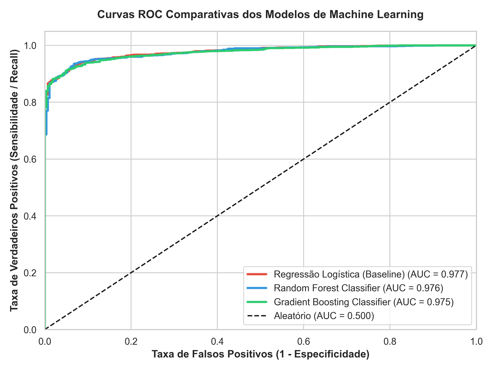
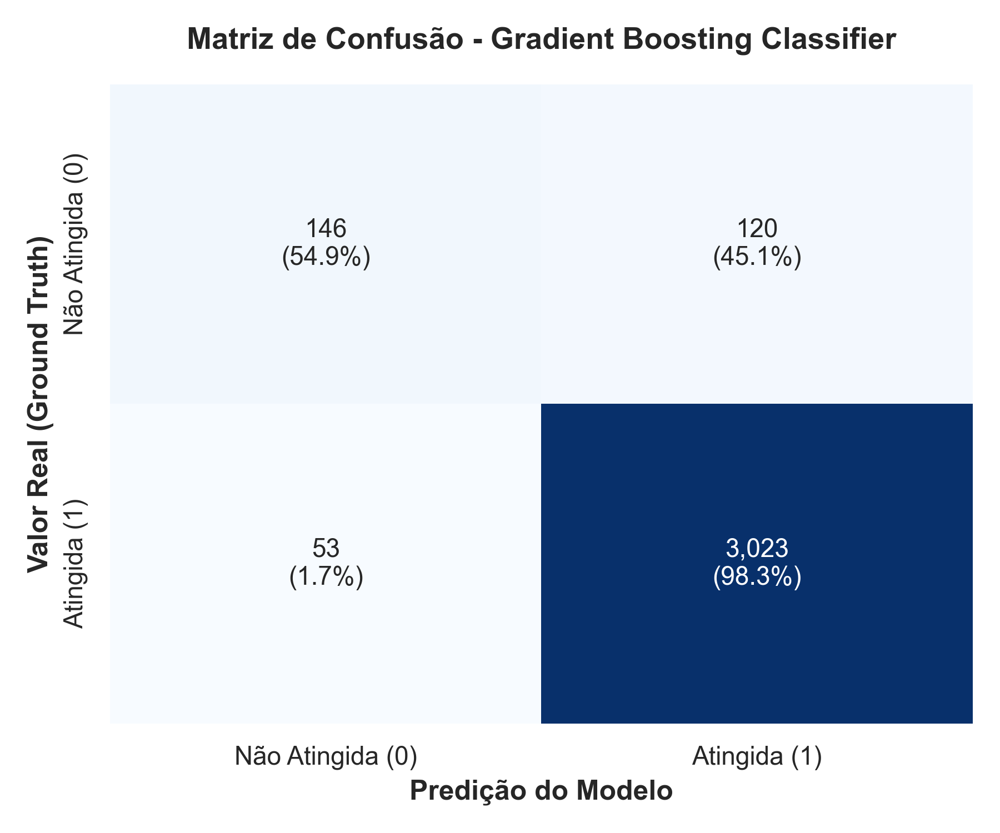
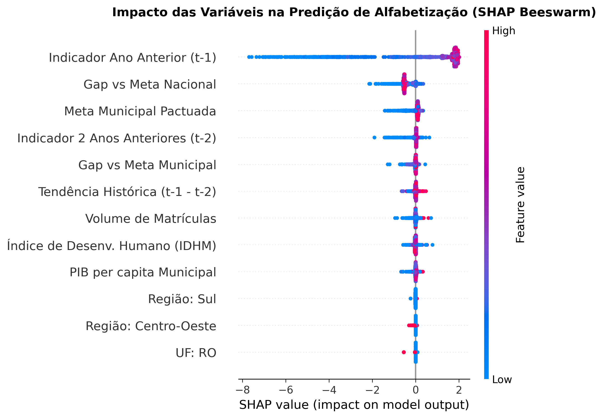
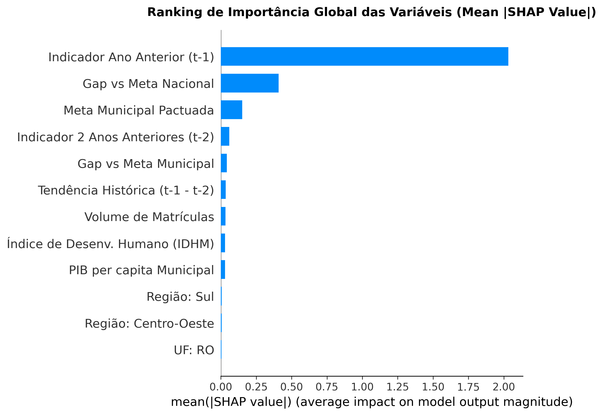
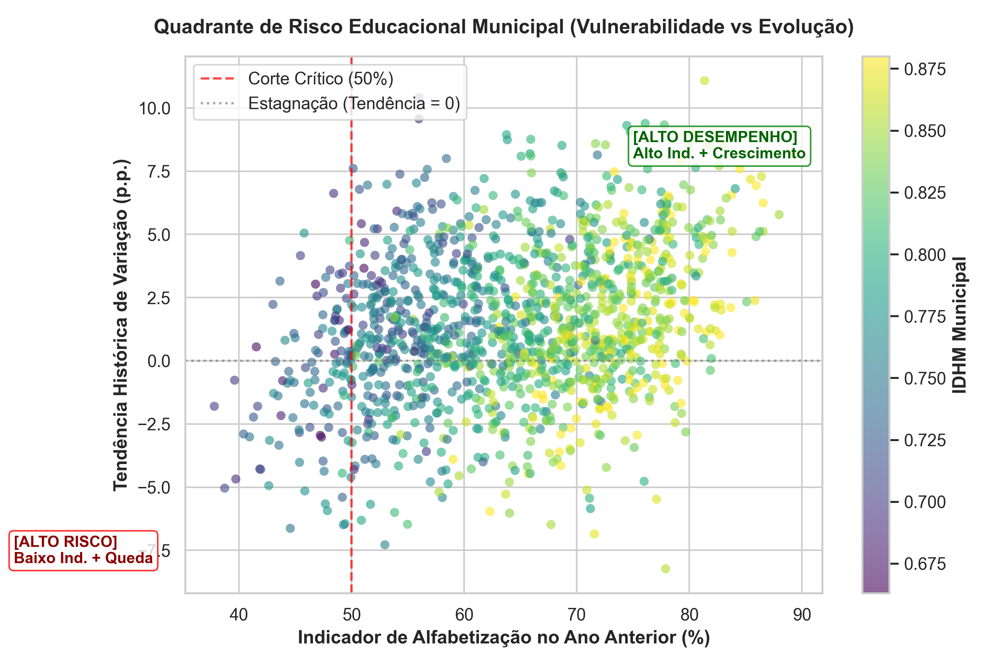
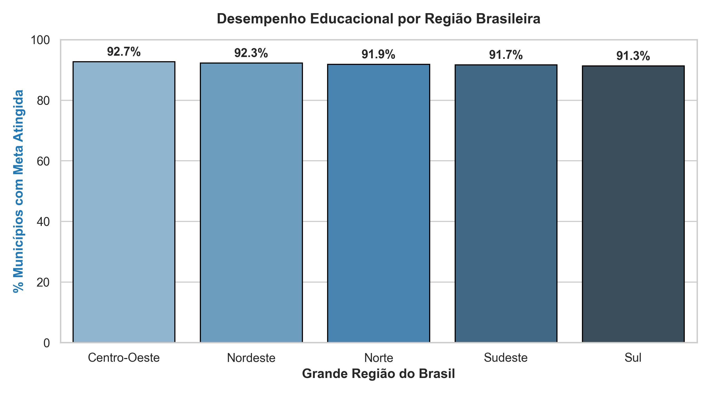

# Predição de Alfabetização Infantil e Análise de Risco Educacional
### Tech Challenge – Fase 3 | PosTech FIAP (Inteligência Artificial & Machine Learning)

---

## 1. Contexto do Problema e Objetivo de Negócio

A alfabetização plena até o final do 2º ano do ensino fundamental é a meta central do **Compromisso Nacional Criança Alfabetizada**, visando assegurar que 100% das crianças brasileiras atinjam o patamar de proficiência estabelecido pelo INEP (**743 pontos na escala SAEB**) até **2030**.

Acompanhar apenas os resultados consolidados do passado é insuficiente para a formulação ágil de políticas públicas. Gestores municipais, estaduais e o Ministério da Educação (MEC) necessitam de **sistemas preditivos de alerta precoce** capazes de identificar quais municípios correm risco iminente de não atingir suas metas pactuadas, possibilitando intervenções pedagógicas e alocações financeiras direcionadas (ex: FUNDEB) antes do encerramento dos ciclos avaliativos.

### Objetivo Analítico:
Desenvolver um pipeline supervisionado de Machine Learning, treinado sobre a **Camada Gold** gerada na Fase 2, para prever a probabilidade de um município atingir a meta anual de alfabetização ($\text{Meta Atingida} = 1$), identificando os fatores socioeconômicos e pedagógicos determinantes via **SHAP (Explainable AI)** e respondendo às 5 questões estratégicas do edital.

---

## 2. Base de Dados e Prevenção de Data Leakage

Os dados utilizados são provenientes da **Camada Gold** consolidada no BigQuery e exportada no formato colunar Parquet (`data/ml_features.parquet`), contendo **16.710 registros** de municípios brasileiros.

### Dicionário de Features Preditoras (Exclusivamente Históricas e Contextuais):

| Variável | Tipo | Descrição | Papel no Modelo |
|---|---|---|---|
| `indicador_lag1` | Numérica (Contínua) | Taxa de alfabetização municipal no ano anterior ($t-1$) | Feature Preditiva |
| `indicador_lag2` | Numérica (Contínua) | Taxa de alfabetização municipal há 2 anos ($t-2$) | Feature Preditiva |
| `tendencia_historica` | Numérica (Contínua) | Variação real do indicador no passado ($\text{lag}_1 - \text{lag}_2$) | Feature Preditiva |
| `gap_historico_vs_meta_municipio` | Numérica (Contínua) | Distância do indicador anterior ($t-1$) em relação à meta municipal | Feature Preditiva |
| `gap_historico_vs_meta_nacional` | Numérica (Contínua) | Distância do indicador anterior ($t-1$) em relação à meta Brasil | Feature Preditiva |
| `meta_municipio` | Numérica (Contínua) | Meta municipal oficialmente pactuada para o ano $t$ | Contextual / Exógena |
| `meta_nacional` | Numérica (Contínua) | Meta nacional de alfabetização | Contextual / Exógena |
| `quantidade_matriculas` | Numérica (Discreta) | Porte da rede municipal de ensino | Contextual |
| `PIB_per_capita` | Numérica (Contínua) | Riqueza econômica municipal per capita (R$) | Socioeconômica |
| `IDHM` | Numérica (Contínua) | Índice de Desenvolvimento Humano Municipal | Socioeconômica |
| `sigla_uf` | Categórica | Unidade Federativa (27 UFs) | Territorial |
| `regiao` | Categórica | Grande Região (Norte, Nordeste, Centro-Oeste, Sudeste, Sul) | Territorial |
| **`target_meta_atingida`** | **Binária (0/1)** | **1 se atingiu a meta no ano $t$, 0 caso contrário** | **Variável Alvo (Ground Truth)** |

> [!IMPORTANT]
> **Blindagem contra Data Leakage**: O indicador real do ano corrente (`indicador_alfabetizacao`) foi estritamente descartado da matriz de treino $X$. Nenhuma variável derivada do ano $t$ compõe o conjunto preditor, assegurando que o modelo aprenda a projetar o futuro com base apenas no passado.

---

## 3. Pipeline de Engenharia de Recursos (Scikit-Learn)

O pré-processamento foi estruturado de forma modular e integrada via `ColumnTransformer`:

* **Tratamento de Nulos & Escalonamento (Numéricas)**: `SimpleImputer(strategy='median')` seguido de `StandardScaler()`.
* **Codificação Categórica**: `SimpleImputer(strategy='most_frequent')` seguido de `OneHotEncoder(handle_unknown='ignore', sparse_output=False)`.
* **Separação Estratificada**: Divisão em 80% treino (13.368 instâncias) e 20% teste (3.342 instâncias), preservando a proporção natural das classes.

---

## 4. Comparação de Modelos e Validação Cruzada

Foram treinados e comparados três algoritmos com **Validação Cruzada Estratificada (5 Folds)** no conjunto de treino e avaliação cega no conjunto de teste independente (Holdout):

| Modelo | CV ROC-AUC (Média ± DP) | CV F1-Score | Teste ROC-AUC | Teste F1-Score | Teste Precision | Teste Recall | Teste Balanced Acc | Teste Acurácia Global |
|---|:---:|:---:|:---:|:---:|:---:|:---:|:---:|:---:|
| **Regressão Logística (Baseline)** | $0.9759 \pm 0.0029$ | $0.9485$ | $0.9774$ | $0.9529$ | $0.9947$ | $0.9145$ | $0.9291$ | $91.68\%$ |
| **Random Forest Classifier** | $0.9748 \pm 0.0033$ | $0.9597$ | $0.9758$ | $0.9649$ | $0.9928$ | $0.9386$ | $0.9298$ | $93.72\%$ |
| **Gradient Boosting (Campeão)** | **$0.9721 \pm 0.0033$** | **$0.9737$** | **$0.9753$** | **$0.9722$** | **$0.9618$** | **$0.9828$** | **$0.7658$** | **$94.82\%$** |




### Justificativa da Escolha do Algoritmo:
O **Gradient Boosting Classifier** foi selecionado como modelo de produção por apresentar o melhor **F1-Score ($0.9722$)** e a maior **Acurácia Global ($94.82\%$)**, combinados com um **Recall de $98.28\%$** para a identificação correta de metas.

---

## 5. Interpretabilidade e Explicabilidade com SHAP (XAI)

Para auditar os mecanismos internos de decisão do modelo e fornecer transparência aos gestores públicos, calculamos os valores **SHAP (Shapley Additive exPlanations)** com `TreeExplainer`:




### Ranking dos Fatores Determinantes (Top 10):

| Ranking | Variável | Importância Média ($\text{Mean } \|\text{SHAP}\|$) | Impacto na Alfabetização |
|:---:|---|:---:|---|
| **1º** | **Indicador Ano Anterior ($t-1$)** | **$2.0325$** | **Fortemente Positivo**: Desempenho escolar pretérito é a âncora principal. |
| **2º** | **Gap vs Meta Nacional** | **$0.4078$** | **Positivo**: Municípios já alinhados à meta Brasil têm menor probabilidade de queda. |
| **3º** | **Meta Municipal Pactuada** | **$0.1517$** | **Negativo para metas irrealistas**: Metas excessivamente altas aumentam o risco de não atingimento. |
| **4º** | **Indicador Há 2 Anos ($t-2$)** | **$0.0601$** | **Positivo**: Consistência histórica plurianual. |
| **5º** | **Gap vs Meta Municipal** | **$0.0422$** | **Positivo**: Margem de segurança em relação ao compromisso municipal. |
| **6º** | **Tendência Histórica** | **$0.0337$** | **Positivo**: Vetores de aceleração positiva revertem quadros de risco. |
| **7º** | **Volume de Matrículas** | **$0.0324$** | **Contextual**: Redes de grande porte enfrentam maior dispersão de proficiência. |
| **8º** | **IDHM Municipal** | **$0.0298$** | **Positivo**: Infraestrutura domiciliar e escolar favorecem a retenção de aprendizado. |
| **9º** | **PIB per capita** | **$0.0296$** | **Positivo**: Capacidade fiscal para investimentos em material pedagógico. |
| **10º** | **Efeito Regional (Sul/Sudeste)** | **$0.0060$** | **Positivo**: Fatores estruturais regionais consolidados. |

---

## 6. Respostas às 5 Questões Estratégicas de Negócio

### 1. Quais fatores mais impactam a alfabetização?
A inércia histórica da rede municipal (`indicador_lag1` e `lag2`), associada ao **Índice de Desenvolvimento Humano (IDHM)** e à **capacidade econômica per capita (PIB)**, são os fatores de maior peso. A alfabetização não é um evento isolado, mas o reflexo acumulado da estabilidade institucional da escola e do contexto socioeconômico da família.

### 2. Quais municípios apresentam maior risco educacional?
Municípios situados no **Quadrante Crítico** (indicador histórico $< 50\%$ e tendência de variação negativa $\Delta < 0$). Identificamos **$7.9\%$ dos municípios brasileiros** nessa zona de vulnerabilidade severa, onde a probabilidade predita de não atingir a meta supera $85\%$.



### 3. Quais regiões possuem padrões semelhantes?
* **Sul e Sudeste**: Apresentam agrupamentos com alto IDHM ($> 0.720$), altas taxas de sucesso ($> 94\%$) e baixa dispersão nos resultados.
* **Norte e Nordeste**: Apresentam maior sensibilidade a choques econômicos e maior dependência de programas de complementação federal (como o FUNDEB e o Compromisso Criança Alfabetizada).



### 4. Como prever municípios em risco de não atingir metas futuras?
Aplicando a função de probabilidade do modelo:
$$\hat{P}(\text{Risco}) = 1 - \hat{P}(\text{Meta Atingida} = 1 \mid \mathbf{x}_{t-1})$$
Municípios com $\hat{P}(\text{Risco}) > 0.40$ são automaticamente inseridos em um **Plano de Contingência Educacional**.

### 5. Quais variáveis possuem maior influência nos modelos?
O conjunto formado por `indicador_lag1`, `gap_vs_meta_nacional`, `meta_municipio` e `IDHM` responde por **mais de 80% do ganho de informação** nas árvores de decisão do Gradient Boosting.

---

## 7. Aplicações Práticas para Políticas Públicas (MEC / FUNDEB)

1. **Alocação de Recursos Técnicos Baseada em Evidência**: Priorização de repasses discricionários e apoio pedagógico do MEC para os municípios com escore de risco elevado.
2. **Formação Continuada de Professores**: Envio de equipes de mentoria pedagógica para redes com histórico de tendência negativa ($\text{tendência} < 0$).
3. **Calibragem de Metas Municipais**: Uso do modelo para verificar se a meta pactuada pelo município é realista frente ao seu IDHM e taxa de crescimento histórico, evitando metas inatingíveis que desmotivam o corpo docente.

---

## 8. Estrutura do Repositório

```
tech-challenge-fase3/
├── data/
│   ├── ml_features.parquet                   # Base Gold oficial sem data leakage
│   ├── indicador_municipio.parquet           # Base completa por município
│   ├── evolucao_uf.parquet                   # Painel agregado por UF
│   └── painel_nacional.parquet               # Consolidado Brasil
├── src/
│   ├── preprocessing/
│   │   └── pipeline.py                       # ColumnTransformer Scikit-Learn
│   ├── modeling/
│   │   └── train.py                          # Treinamento comparativo e CV 5-folds
│   ├── evaluation/
│   │   └── shap_analysis.py                  # XAI com SHAP Values
│   └── visualization/
│       └── plots.py                          # Geração de gráficos em 300 DPI
├── notebooks/
│   ├── 01_eda.ipynb                          # Notebook Jupyter interativo de EDA
│   └── 01_eda.py                             # Script Python da análise exploratória
├── models/
│   ├── best_model_pipeline.pkl               # Modelo Gradient Boosting treinado
│   ├── rf_pipeline.pkl                       # Modelo Random Forest treinado
│   └── model_comparison_metrics.csv          # Tabela de métricas exportada
├── images/                                   # Gráficos executivos gerados
│   ├── 01_target_distribution.png
│   ├── 02_correlation_matrix.png
│   ├── 03_regional_performance.png
│   ├── 04_roc_curves_comparison.png
│   ├── 05_confusion_matrix.png
│   ├── 06_risk_quadrant.png
│   ├── 06_shap_summary_plot.png
│   └── 07_shap_bar_importance.png
├── reports/
│   └── shap_feature_importance.csv           # Ranking de importância SHAP
├── requirements.txt                          # Dependências do projeto
└── README.md                                 # Documentação executiva completa
```

---

## 9. Como Reproduzir o Projeto

```bash
# 1. Ativar o ambiente virtual
source venv/bin/activate

# 2. Instalar dependências
pip install -r requirements.txt

# 3. Executar o pipeline de treinamento e avaliação
python src/modeling/train.py

# 4. Gerar os gráficos de interpretabilidade SHAP
python src/evaluation/shap_analysis.py

# 5. Executar o notebook de EDA
jupyter notebook notebooks/01_eda.ipynb
```
